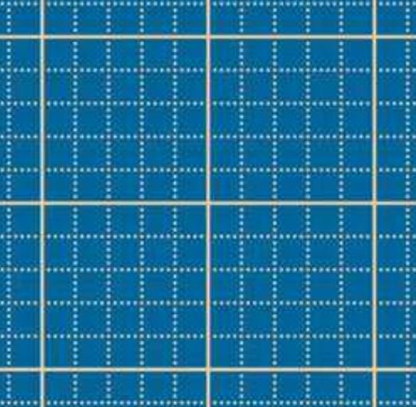

# basekit

General base-conversion toolkit extracted from the broader `new_system` idea, with a fast preset for dozenal use.

## Python package and CLI

This repo now includes a Python package and CLI for exact base conversion using the generic notation:

`<base-marker>_<number>`

Base marker rule:
- Marker is the digit for `(base - 1)`, using `0123456789abcdefghijklmnopqrstuvwxyz`
- Base 10 marker is `9`
- Base 12 marker is `b`
- Output digits and markers are lowercase

Examples:
- `b_10` means `10` in base 12 (decimal `12`)
- `9_12` means `12` in base 10 (decimal `12`)
- Chain target: `b_10 = 9_12 = 12`

### Base marker examples

| Base | Marker | Example |
| --- | --- | --- |
| 2 | `1` | `1_101` |
| 10 | `9` | `9_12` |
| 12 | `b` | `b_10` |
| 16 | `f` | `f_ff` |
| 36 | `z` | `z_z` |

### Install (local)

```bash
pip install -e .
```

### Library quickstart

```python
from fractions import Fraction
from basekit import base, dozenal as doz, convert, equivalence_chain

print(convert("b_10", 10))             # 9_12
print(convert("2_0.1", 10))            # 9_0.(3)
print(equivalence_chain("b_10", [12, 10]))
# b_10 = 9_12 = 12

print(doz(100))                        # 144
print(base(3)(10))                     # 3
print(doz("10.6"))                     # Fraction(25, 2)

print(doz.fmt(144))                    # 100
print(doz.fmt(144, marked=True))       # b_100
print(base(10).fmt(Fraction(1, 3)))    # 0.(3)
```

### CLI quickstart

```bash
basekit convert b_10 --to-base 10
# 9_12

basekit chain b_10 --bases 12,10
# b_10 = 9_12 = 12

# alias still available
dozenal convert b_10 --to-base 10
```

### Exactness and repeating output

- Conversion uses exact rational arithmetic (`fractions.Fraction`)
- No float fallback by default
- Non-terminating expansions are emitted as repeating notation:
  - `1/3` in base 10 -> `9_0.(3)`

# Base 12, Dozenal
12 has twice as many (non-trivial) divisors as 10:

10: (1) 2 5 (10)

12: (1) 2 3 4 6 (12)

So divisions by 3 do not create periodic numbers:
- $\frac{1}{3} = 0.3333...$ vs $\frac{1;}{3} = 0;4$

And divisions by 4 are easier:
- $\frac{1}{4} = 0.25$ vs $\frac{1;}{4} = 0;3$

Division by 5 is worse, but that's greatly compensated when looking at divisions by 6, 8, and 9:
- $\frac{1}{5} = 0.2$ vs $\frac{1;}{5} = 0;2497...$
- $\frac{1}{6} = 0.1666...$ vs $\frac{1;}{6} = 0;2$
- $\frac{1}{8} = 0.125$ vs $\frac{1;}{8} = 0;16$
- $\frac{1}{9} = 0.1111...$ vs $\frac{1;}{9} = 0;13$

This is because these numbers are often multiples of 3 and 4, and work well in dozenal base.

It's more likely to have a number being multiple of 3 or 4 than 5 (One out of every three integers is divisible by three, while only one out of every 5 is divisible by 5), but to enjoy the effects of dozenal base your number has to be a multiple of EITHER 3 or 4, which makes it even more likely.

Here's a table summarizing common divisions:
| Fraction      | Decimal     | Dozenal    | Dozenal is     |
| ------------- | ----------- | ---------- | -------------- |
| $\frac{1}{2}$ | 0.5         | 0;6        | About the same |
| $\frac{1}{3}$ | 0.3333...   | 0;4        | Better         |
| $\frac{1}{4}$ | 0.25        | 0;3        | Better         |
| $\frac{1}{5}$ | 0.2         | 0;2497...  | Worse          |
| $\frac{1}{6}$ | 0.1666...   | 0;2        | Better         |
| $\frac{1}{7}$ | 0.142857... | 0;186A3... | About the same |
| $\frac{1}{8}$ | 0.125       | 0;16       | Better         |
| $\frac{1}{9}$ | 0.1111...   | 0;13       | Better         |

12 is the smallest number with 4 factors. A highly composite number. So it's a good choice. The only close alternative would be base 6, but seems too small.

## Patterns
Also, with decimal base you can know if any number is divisible by 2 or 5 just looking at the last digit. If it ends on 0, 2, 4, 6, or 8, then it's divisible by 2. If it ends on 0 or 5, then it's divisible by 5. With base 12, since it has a lot more factors, this happens way more often. If it ends with 0 or 6, it's divisible by 6. If it ends with 0, 4, or 8, it's divisible by 4. If in ends with 0, 3, 6, or 9, it's divisible by three. If it ends with 0, 2, 4, 6, 8, or X, it's divisible by 2.

Counting in threes, fours and sixes creates easy patterns in base 12, but not in decimal, where only 5s are easy. 3 6 9 12 15 18 21 24 27 30 vs **3 6 9** 1**0** 1**3** 1**6** 1**9** 2**0** (3690...)

If you were writing dimensions in a computer program, in decimal, you would not be able to write a third of a millimeter as a dimension, because you would have to write 0.33333333, inexactly with rounding errors. You would need fractions. In dozenal base you could write 0;4.

To express 1/4 we say 0;3 (3/12) instead of 0.25 (25/100).

To express 1/3 we say 0;4 (4/12). Decimal base would be 0.3333...

That's why having many divisors is good.

Using the TV volume for example, or numbers 0 to 10, many people choose the even numbers, and 5 too, since it's 10/2. Well, in dozenal base 10;/2 = 6, which is even, so the pattern is clean. This helps to get rid of standards like having M4 M5 and M6 bolts. Just use either M4 or M6.

If you want to express angles as fractions of a whole turn, instead of using degrees or radians, which to me seems like the most intuitive approach: 90º would become 0;3, 60º -> 0;2, 30º -> 0;1 ... with decimal base it'd be strange, 90º = 0.25, 60º = 0.1666... 30º = 0.0833...

As another example, suppose you have graph paper with a thick grid every 5 squares of the thin grid (half ten). In this case, you only have reference to draw fractions of 1/5th the big square. However, if you add just one square, with the big grid being 6 small squares wide (half twelve), now you can draw half of the big square (3 units), 1/3rd of the big square (2 units), and 1/6th. Much more useful to be able to draw halves and thirds.




An interesting pattern about design is how frequently 2.5mm is used, to dimensions as a multiple of 2.5mm, having 5mm 10mm, 12.5mm etc. This comes from dividing things into quarters. Note that there is no inherent need for that exact dimension, it's our decimal system what makes us choose that number. In dozenal base, it'd be either 2mm (sixths), 3mm (fourhts), or 4mm (thirds). No fractional part required, and more options to choose from.
> I don't think 2.5mm is often used... think again: https://youtu.be/pNiTnWNfSNU?si=xG5Q67rk88PWJWR9&t=682

## Historic evidence of 12

Even being used to base 10 we naturally end up using multiples of 6 and 12: A day has 24h: 12h day and 12h night, that means that, for example, the hour 18, or 6pm would be written as 16, where the 6 is the hour, and the 1 means "pm". It matches. The earth rotates pi/12 rad = 0;1 pi rad (or 0.08333 pi rad) in 1h. There are 12 musical notes in western music, there are 12 months in a year, the imperial system was based around 12 for lengths (1 foot = 12 inches), "twelve" is the largest number in English with a single morpheme. The standard frame rate for movies is 24fps (20;fps), for normal video 60fps (50; fps), high frame rate smartphones 120fps (X0; fps), and for gaming 144fps (100; fps). It's in dozenal. That means that each frame lasts 0.04167s or 0;06s in base 12. Base 10 makes even millimeter divisions in rulers hard to read because each cm is divided into 2 groups of 5 mm, and it's hard to differentiate between 4 equal lines. With base 12 you would have 4 big divisions, 3 lines, (instead of just 1), and 3 smaller divisions, 2 lines (instead of 4).

If you had 12 slices of pizza you could share it evenly with 2 people (6 slices each), 3 people (4 slices each), 4 people (3 slices each) or 6 people (2 slices each). On the other hand, if you had 10 slices of pizza you could only share it evenly with only 2 people(5 slices each) or 5 people (2 slices each).

Because of its divisibility, 12 has been used as the base for many monetary systems (12 pence = 1 shilling), which consequently made humans sell eggs in dozens.

> Though we often find ourselves dividing things into fifths, it will be noted that, more often than not, we are only doing so because we are using a base ten system. We are used to quantifying things in terms of groups of tens, and as a result we naturally quantify things in groups of five as well, but there is in general no particular reason why this needs to be the case.
> 

> Humanity is, possibly, on the verge of a glorious and infinite future. The rise of the metric system is institutionalizing the decimal radix not just for counting, but for measuring and quantifying the world itself. With the advent of modern computers and the internet, we are potentially setting in place structures and systems that will define our relationships with information and information technology for countless generations to come. It would behoove us to pause and reflect on whether or not this is really a system worth further embedding into the fundamental fabric of our civilization.
> 

[https://hexnet.org/content/argument-dozenalism](https://hexnet.org/content/argument-dozenalism)

We usually divide the 360º (or 260; º) into 30º segments, leaving us with 12 segments. The number of sides of the polygon with the smaller possible number, the triangle, is not a divisor of base 10, but it is of base 12. The only regular polygons that tessellate have 3, 4, and 6 sides. None of them are divisors of base 10, but all of them are of base 12. In fact, hexagons are everywhere in nature and engineering. A hexagonal grid (6, half of 12, not divisor of 10) is the best way to divide a surface into regions of equal area with the least total perimeter. That's why bees make hexagonal honeycombs. We also have screws with hexagonal heads... If you wanted to pack a bunch of circles together in the most efficient way possible, you would surround a central circle by another 6, where the centers of the circles form a hexagonal pattern. Some people always design with multiples of 12 with this in mind. Some standard DC voltages are 12V (cars), 24V or 20;V (airplanes, 24;V the generator), 48V or 40;V (cars, airplanes, elevators, li-ion batteries, solar systems... it's legally defined as the max safe DC voltage). 3d printers, appliances, all their sensors and actuators, motors... They all use 12, 24, or 48V. Some 96V (80;V).

1h = 0.04166... days, or 0;06 days.

All those 0.125, 0.25 (fourths), 0.333 0.333 and 0.667 would disappear. For example the pitches of METRIC screws are often 1mm, 1.25mm, 1.5mm, 1.75mm. They would become 1;mm, 1;3mm, 1;6mm, and 1;9 mm. Tyres are often 2.125in, they would become 2;16in

With the metric scientific notation we can use prefixes every 3 zeros, ($1000W = KW, 10^6 W = MW, 10^9 W = GW$...) so the exponents end up being 0 3 6 9 12 15 18 21 24 27... Very odd. With dozenal numbers: 0 3 6 9  10; 13; 16; 19;  20; 23; 26; 29; ... (0369 0369). This happens because 3, of 3 zeros, is a divisor of 12. Therefore every 4 repetitions we end up with a multiple of 12. A round number. To make this work in decimal base we would need prefixes every 2 zeros or every 5 zeros. Annoying.

<details>
    <summary>Google Docs and Word font sizes</summary>


</details>

Music has often been tuned to 432Hz. That turns out to be 300;Hz. It’s practical when you want different instruments with different fundamental notes to be able to transpose the music and play together (Alto sax at Eb with tenor at Bb with piano at C, playing the same sheet. You need their frequencies to match. It’s easier with multiples of 10;)

Let’s think how to get a standard voltage for lithium ion battery packs with nominal voltage of 3.6V. If we put 10 cells in series we get 36V, which is 30;V, a standard voltage. However, if we want the amount of cells in the battery pack to be a multiple of 12, to get many different layout possibilities that leave no empty spaces, we need a multiple of 12, not 10. If we just multiply by 10 AND 12, we get a battery pack of 10*12*3.6V = 432V. Yes, the same number as in music tuning.

## Computers
To express any arbitrary base in a computer program: "last digit of the base using 1,2,...,9,A,B...,Z"_"number"."fractional part". For example: 12.5 = 9_12.5 = B_10.6 = 1_1100.1
TODO MAYBE REPLACE BY "last digit of base".."number"."fractional part"

Computers don't care what base we use. They always have to convert between binary and our base. In fact, this is what happens when you use decimal base numbers approximated in floating-point binary arithmetic. Tenths are just as hard to represent by computers as twelfths. Only halves are exact. (0.5, 0.25, 0.125, 0.0625... 0;6, 0;3, 0;16, 0;09...)

](README/Untitled%204.png)

[https://realpython.com/python-numbers/](https://realpython.com/python-numbers/)

- Code to convert from decimal to this format:
    ```python
    import numpy as np
    def convert_base(number, base=12):
      symbol = np.base_repr(base-1,base)
      return np.base_repr(base-1,base) + '_' + np.base_repr(number,base)
    
    # convert_base(143,12)
    convert_base(143)
    
    # Result: 'B_BB'
    ```

## How to use
The written nomenclature is to just change the decimal point (.) for the semicolon (;), and always write it, whether there is fractional part (decimals) or not, to indicate that it's a dozenal number. The consistent nomenclature for computers is expressed before.

The extra symbols required are just A (10) and B (11). To distinguish them from the alphabet letter while talking, some people like to call them:
- A: "dek" (from "deka", the greek prefix for 10). Also may be written as $X$, $\alpha$, or $\chi$.
- B: "il" (from "eleven"). Also may be written as $B$, $\beta$, or $\varepsilon$.
- For $10; = 12$, the word is "Do", of dozen.

- Standard way: $10;$, $10;6$
    - When talking, say "sub" for subunit:
        - $A;6$ → "A sub six" (10.5)
        - $12;3$ → "Do two sub three" (14.25)
- You may find:
    - With *italics*: *10*
    - Subscript 12: $10_{12}$
    - Subscript z: $10_z$
    - Superscript ': $10'$
    - *0;1* → edo, instead of "sub one"
- In handwriting you may write a long curly comma instead of ;

Examples:
| Decimal | Dozenal | Spoken          |
| ------- | ------- | --------------- |
| 1       | 1;      | One             |
| 2       | 2;      | Two             |
| 10      | A;      | Dek             |
| 11      | B;      | Il              |
| 12      | 10;     | Do              |
| 13      | 11;     | Do 1            |
| 14      | 12;     | Do 2            |
| 20      | 16;     | Do 6            |
| 23      | 1B;     | Do Il           |
| 24      | 20;     | Two do          |
| 30      | 26;     | Two do 6        |
| 36      | 30;     | Three do        |
| 40      | 34;     | Three do 4      |
| 48      | 40;     | Four do         |
| 50      | 42;     | Four do 2       |
| 60      | 50;     | Five do         |
| 70      | 5A;     | Five do dek     |
| 72      | 60;     | Six do          |
| 80      | 68;     | Six do 8        |
| 84      | 70;     | Seven do        |
| 90      | 76;     | Seven do 6      |
| 96      | 80;     | Eight do        |
| 100     | 84;     | Eight do 4      |
| 108     | 90;     | Nine do         |
| 120     | A0;     | Dek do          |
| 144     | 100;    | Gro             |
| 1728    | 1000;   | Mo              |
| 2012    | 11B8;   | Mo gro il eight |

More names:
| Dozenal                   | Spoken   |
| ------------------------- | -------- |
| ;001                      | emo      |
| 10 000;                   | do mo    |
| 100 000;                  | gro mo   |
| 1 000 000; $\quad (10^6)$ | bi mo    |
| $10^9$                    | tri mo   |
| $10^{-9}$                 | e tri mo |
I prefer scientific notation even talking


To read afternoon hours in digital clocks we do the 10 to 12 conversion. 18 = 6pm = half a day + 6 hours = 16; = Do six. Hours go from 0 to 20; = 2do. Noon is at 10; = do.

](README/Untitled%207.png)

[https://www.reddit.com/r/math/comments/554f94/is_base12_actually_the_best_number_system/](https://www.reddit.com/r/math/comments/554f94/is_base12_actually_the_best_number_system/)

## Convert between bases

[Ben eater - How do computers convert to decimal](https://youtu.be/v3-a-zqKfgA)

Convert base 10 to base 12 - example:

$1000_{10}$ to base 12.

$1000_{10} = 83*12+4 = 6*12*12+11*12+4$

The important thing is the rest. If 1000mod12 (the rest) = 4, then we know that in a grid with a separation of 12, this number exceeds the grid by 4 units, and that will have to be represented in the units place. Then we use a 100; grid, that matches with the previous grid, but with less resolution, and see the excess of the next division. That's what doesn't fit in the 144 place, but does fit in the 12 place, since it was the quotient of the previous division by 12.


You are taking blocks of 12 and writing what doesn't fit as the first smallest digit. If you wanted to convert to base 12 a fractional number, you would have to multiply by 12, instead of divide by 12, in order to figure out what does not fit into a grid of twelves. What is left is the smallest digit.

A faster way might be to memorize the multiples of 12, 144, and 1728 in base 10, and decompose the number as as sum of multiples of these numbers, going from big to small.

[http://www.dozenal.org/articles/DSA-ConversionRules.pdf](http://www.dozenal.org/articles/DSA-ConversionRules.pdf)


## To learn

- Understand how it works, and practice with the hours of the day. Say the time in base 12.
- Learn the multiplication tables
    - Table of 2 , then look at every other digit of the table of 2 to get the table of 4 (480480... pattern), then 8 doing the same thing (840840...). Then table of 3 (3690...), the table of 9 (9630...), 9 is 3 units away from 10; so the same pattern as 3 appears, but backwards. Then you have the table of 6 (0606...), and the table of E, where you add 1 to the dozens and subtract one from the units (E 1X 29 38 47...). The digits have to add to E. Then the 3 hard ones are 5, 7, and X.
- Practice common divisions by hand
    - 25/12 = 2.0833333 = 21;/10; = 2;0B (or $2;0\varepsilon$ by hand)
    - 0.33333 to base 12,
    
- Learn the multiples and powers of 10 ($\chi)$ in base 12. It will be useful to convert round and big numbers.
- Learn the multiples and powers of 10; ($12$) in base 10. To be able to recognize them in base 10.
- When solving any math problem, do it using dozenal unit prefixes and numbers.

## To promote

- [Dozenal multiplication tables in anki](https://ankiweb.net/shared/info/147541682)
- Create a Python interpreter that can understand all bases expressed, not just 0xff, 0b11, 99, generic 9_99, f_ff, 1_11
- Create apps, widgets, linux programs, etc. to show the time with dozenal numbers
- Include a complete dozenal course in the recreative math section of Khan Academy
- Start adding compatibility to everything. For example add a setting in the HP50G calculator to use dozenal by default.
    - [https://stackoverflow.com/questions/43771853/how-do-compilers-convert-their-internal-binary-representation-to-decimal-for-dis](https://stackoverflow.com/questions/43771853/how-do-compilers-convert-their-internal-binary-representation-to-decimal-for-dis)
    - The itoa function is used in C to convert a number (internally represented as binary) to a string of characters. [https://android.googlesource.com/kernel/lk/+/qcom-dima-8x74-fixes/lib/libc/itoa.c](https://android.googlesource.com/kernel/lk/+/qcom-dima-8x74-fixes/lib/libc/itoa.c)
- Make or find python and hp50g dozenal to decimal base converters. General for any base.
- Make databases of fundamental constants, material properties, and adimensional numbers in dozenal base.

Imperial units could be easily fixed (un-messed) if we stuck to multiples of 12 and expressed them with dozenal base.


## References

[https://en.wikipedia.org/wiki/Duodecimal](https://en.wikipedia.org/wiki/Duodecimal)

Numberphile [https://youtu.be/U6xJfP7-HCc](https://youtu.be/U6xJfP7-HCc)

Base 10 vs base 12 [https://youtu.be/HVk_viJEDII](https://youtu.be/HVk_viJEDII)


[http://www.dozenalsociety.org.uk/sitemap.html](http://www.dozenalsociety.org.uk/sitemap.html)

[http://duodecimal.net/archives/duodecimal/duodecimal.html](http://duodecimal.net/archives/duodecimal/duodecimal.html)

Base pi [https://youtu.be/PNuLvWGeihY](https://youtu.be/PNuLvWGeihY)

[Estamos CONTANDO MAL o POR QUÉ la BASE 12 mola más](https://youtu.be/fJvC0mXbhc8)

Seximal? [https://youtu.be/qID2B4MK7Y0](https://youtu.be/qID2B4MK7Y0)

Dozenal music nomenclature: [https://youtu.be/TQNAwr_H2W4](https://youtu.be/TQNAwr_H2W4)

---

[https://clock.dozenal.ca/clock/diurnal_1](https://clock.dozenal.ca/clock/diurnal_1)

## Innovation

[http://bentilly.blogspot.com/2010/07/dozenal-glyphs-modest-proposal.html](http://bentilly.blogspot.com/2010/07/dozenal-glyphs-modest-proposal.html)


## BIG PROBLEM

We cannot use easily both meters and millimeters as standard units because their relation is implied from base 10. 1m = 6E4mm

We don't want to end up with a mix of dozenal and decimal units, like the imperial system. Choose m or mm, but no this: mm, do-mm, gro-mm, mo-mm = 1.728m, m = 6e4;mm, do-m, gro-m, mo-m, do-mo-m...

I think mm are the better unit, because they’re the standard even for big objects like buildings, ships, planes, etc.

The world’s average height of men is $1000; mm = 1728mm$. For women it’s $B0B;mm = 1595mm$

Possible solution: [https://dozenal.fandom.com/wiki/The_Harmonic_System](https://dozenal.fandom.com/wiki/The_Harmonic_System)

## Unit system

### Fundamental unit based on Planck’s length?

$l_0 = l_p = 1.616255e-35m$

$l_1 = 10; l_0$

$l_2 = 10;l_1 = 100; l_0$

$m_0 = l_{28;} = l_0 \times 10^{28}; = 0.55247m$

$m_1 = 10;m_1 = l_{29} = l_0 \times 10^{29}; = 6.63m$

### Other units
Also, by pure chance, if we use the dozenal system along with the fundamental units of the speed of light, and the quantum of action, then it is possible to construct a coherent unit system in which the Rydberg constant, the atomic mass unit, the bohr radius, half the value of the planck length, the charge and mass of an electron, the fine structure constant, the black-body radiation at ice point, the density of water, ... can be approximated with an error <1% by a whole number. (Proposal for the Universal Unit System, Takashi SUGA, 2002).

### Harmonic System of units?

[https://dozenal.fandom.com/wiki/The_Harmonic_System](https://dozenal.fandom.com/wiki/The_Harmonic_System)


### Dozenal Physics

- Systematic Dozenal Nomenclature?
    
    

I think I prefer to just say do-meter mo-meter bi-mo-meter, emo-meter..., written just as d3meter, d6meter... 1000;m = 1d3; m = 1 d3m. You can move the "d3" ("mo") from the number to the prefix. It doesn't change the result. It just rearranges the numbers. 1;110E95*10^22 m→ 1;110E95d22 m  ("blablabla di twenty two meters" or “blablabla do hepta-mo meters”).

## Programs and practical implementation

- Convert to arbitrary base with my general notation:
    
    ```python
    import numpy as np
    
    # Convert to arbitrary base with my favorite format
    def convert_base(number, base=12):
      symbol = np.base_repr(base-1,base)
      return np.base_repr(base-1,base) + '_' + np.base_repr(number,base)
    
    print(convert_base(143))
    # Result: B_BB
    ```
    
- Print dozenal multiplication tables for [Anki](https://ankiweb.net/shared/info/147541682):
    
    ```python
    import numpy as np # to use numpy.base_repr(number,base)
    
    for table in range(2,12): # from 2 to B
      for number in range(2,12): # from 2 to B
        print(np.base_repr(table,12),'*',np.base_repr(number,12),' = ,',np.base_repr(table*number,12),';',sep='')
    ```
    
    ```python
    4*1 = ,4;
    4*2 = ,8;
    4*3 = ,10;
    4*4 = ,14;
    4*5 = ,18;
    4*6 = ,20;
    4*7 = ,24;
    4*8 = ,28;
    4*9 = ,30;
    4*A = ,34;
    4*B = ,38;
    4*10 = ,40;
    ```
    
- Use numpy to convert base
    
    ```python
    # [https://numpy.org/doc/stable/reference/generated/numpy.base_repr.html](https://numpy.org/doc/stable/reference/generated/numpy.base_repr.html)
    
    import numpy as np
    np.base_repr(143, base=12)
    
    # Result: 'BB'
    ```
    
- Base conversion algorithms:
    
    ```python
    # [https://stackoverflow.com/questions/2267362/how-to-convert-an-integer-to-a-string-in-any-base](https://stackoverflow.com/questions/2267362/how-to-convert-an-integer-to-a-string-in-any-base)
    # SIMPLE
    def baseN(num,b,numerals="0123456789abcdefghijklmnopqrstuvwxyz"):
        return ((num == 0) and numerals[0]) or (baseN(num // b, b, numerals).lstrip(numerals[0]) + numerals[num % b])
    
    baseN(12,12)
    # Result: "10"
    ```
    
    ```python
    # ANOTHER SIMPLE
    BS="0123456789ABCDEFGHIJKLMNOPQRSTUVWXYZ"
    def to_base(n, b): 
        return "0" if not n else to_base(n//b, b).lstrip("0") + BS[n%b]
    ```
    
    ```python
    # NO RECURSION PROBLEMS
    BS="0123456789ABCDEFGHIJKLMNOPQRSTUVWXYZ"
    def to_base(s, b):
        res = ""
        while s:
            res+=BS[s%b]
            s//= b
        return res[::-1] or "0"
    ```
    
    ```python
    #base is any base
    def baseConverter(decNumber,base):
      digits = "0123456789ABCDEF"
      remstack = Stack()
      while decNumber > 0:
        rem = decNumber % base
        remstack.push(rem)
        decNumber = decNumber // base
     
      newString = ""
      while not remstack.isEmpty():
        newString = newString + digits[remstack.pop()]
     
      return newString
    print(baseConverter(25,12))
    ```
    
- HP50G base converter
    
    [Bconv.bin](README/Bconv.bin)
    
    [Bconv Instructions.txt](README/Bconv_Instructions.txt)
    
    [Bconv.asc](README/Bconv.asc)
    
- Use int() to go to decimal
    
    ```python
    int('6B4', 12)
    # Result: 1000
    ```
    

- number of factors for each number
    
    
    
    ```python
    def factor_amount(number = 4):
        factors = []
        for whole_number in range(1, number + 1):
            if number % whole_number == 0:
                factors.append(whole_number)
        return len(factors)
    
    min = 2
    max = 24
    factor_amounts = []
    for i in range(min, max+1):
        factor_amounts.append(factor_amount(i))
    
    import numpy as np
    import matplotlib.pyplot as plt
    numbers = np.linspace(min,max,max-min+1)
    plt.bar([str(int(num)) for num in numbers], factor_amounts)
    plt.ylabel('nº of factors')
    plt.xlabel('number')
    plt.show()
    ```
    
